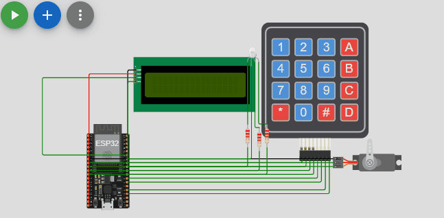
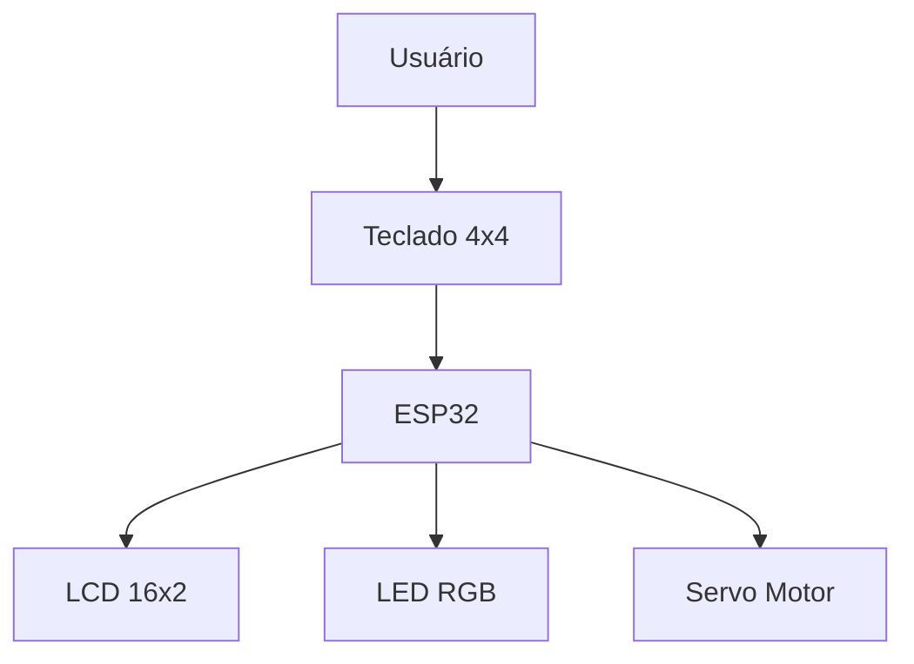
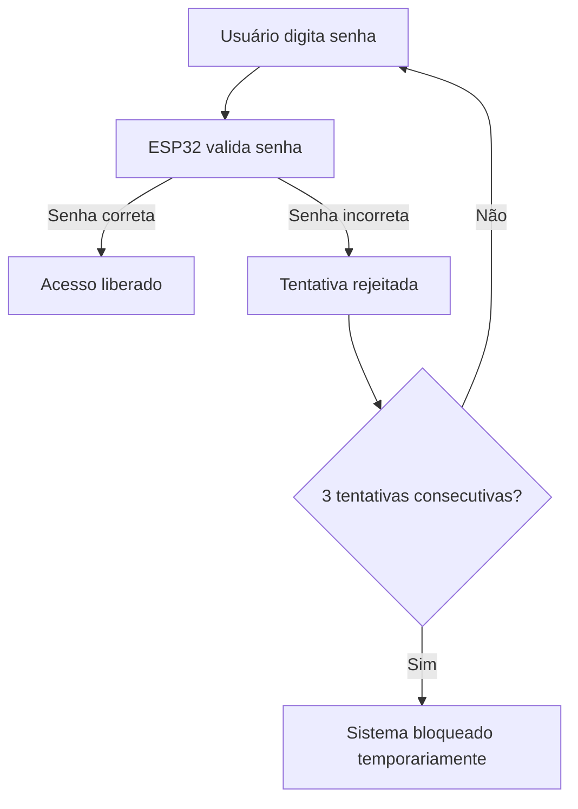
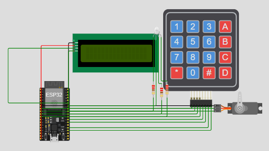

# 🔐 Sistema de Controle de Acesso com ESP32


Projeto acadêmico desenvolvido no curso de **Análise e Desenvolvimento de Sistemas**, na disciplina de **Sistemas Embarcados**.

O sistema implementa um **controle de acesso embarcado baseado em senha**, utilizando ESP32 e diversos periféricos de interface para interação com o usuário.

---

## 🎬 Demonstração do Sistema



---

## 📑 Sumário

- [📌 Visão Geral](#-visão-geral)
- [🧠 Arquitetura do Sistema](#-arquitetura-do-sistema)
- [⚙️ Funcionamento do Sistema](#️-funcionamento-do-sistema)
- [🖥 Interface do Usuário](#-interface-do-usuário)
- [🔧 Componentes Utilizados](#-componentes-utilizados)
- [🎬 Simulação do Circuito](#-simulação-do-circuito)
- [📂 Estrutura do Projeto](#-estrutura-do-projeto)
- [🛠 Tecnologias Utilizadas](#-tecnologias-utilizadas)
- [🚀 MVP1 — Sistema Embarcado Local](#-mvp1--sistema-embarcado-local)
- [🌐 MVP2 — Integração IoT](#-mvp2--integração-iot-planejado)
- [🧪 Simulação](#-simulação)
- [👨‍💻 Autor](#-autor)

---

## 📌 Visão Geral

O sistema permite que um usuário digite uma senha em um **teclado matricial 4x4**.  
Após a validação da senha, o **ESP32** controla um **servo motor**, simulando a abertura de um mecanismo de acesso.

O sistema fornece feedback ao usuário por meio de:

- 📟 Display LCD 16x2 (I2C)
- 💡 LED RGB para indicação de status
- ⚙️ Servo motor para simulação da abertura do acesso

---

## 🧠 Arquitetura do Sistema



O ESP32 atua como unidade central de controle, responsável por:

- leitura do teclado
- validação da senha
- controle dos dispositivos de saída
- gerenciamento do estado do sistema

---

## ⚙️ Funcionamento do Sistema

Fluxo de operação:



---

## 🖥 Interface do Usuário

| Dispositivo | Função |
|-------------|--------|
| LCD 16x2 | Exibição de mensagens do sistema |
| LED RGB | Indicação visual do estado do sistema |
| Servo Motor | Simulação da abertura do acesso |

---

## 🔧 Componentes Utilizados

Hardware utilizado no projeto:

- ESP32
- Teclado Matricial 4x4
- Display LCD 16x2 (I2C)
- Servo Motor
- LED RGB
- Resistores
- Jumpers

---

## 🎬 Simulação do Circuito

Imagem e demonstração da simulação no **Wokwi**:




---

## 📂 Estrutura do Projeto

```text
Controle-Acesso-ESP32
│
├── docs
│ └── documentação do projeto
│
├── firmware
│ └── esp32
│ └── controle_acesso.ino
│
├── simulation
│ └── wokwi
│ ├── diagram.json
│ ├── sketch.ino
│ ├── libraries.txt
│ └── wokwi-project.txt
│
├── hardware
│ └── circuito.png
│
├── README.md
└── .gitignore
```

---

## 🛠 Tecnologias Utilizadas

- ESP32
- Linguagem C/C++ (Arduino Framework)
- Wokwi Simulator
- Git
- GitHub

---

## 🚀 MVP1 – Sistema Embarcado Local

Primeira versão do projeto implementa o sistema funcionando localmente com:

- autenticação por senha
- controle de acesso com servo
- interface com display LCD
- feedback visual (RGB)
- bloqueio após múltiplas tentativas inválidas

Todo o processamento ocorre diretamente no microcontrolador.

---

## 🌐 MVP2 – Integração IoT (planejado)

Na próxima etapa o sistema será expandido para:

- conexão **WiFi**
- envio de eventos para **TagoIO**
- registro de acessos na nuvem
- dashboard de monitoramento

Fluxo planejado:

ESP32 → WiFi → TagoIO → Dashboard


Eventos que poderão ser monitorados:

- acesso liberado
- acesso negado
- sistema bloqueado

---

## 🧪 Simulação

O circuito pode ser executado utilizando o simulador **Wokwi**, através dos arquivos presentes na pasta:

simulation/wokwi

🔗 [Abrir simulação no Wokwi](https://wokwi.com/projects/458231570955241473)

---

## 👨‍💻 Autor

Projeto desenvolvido por **iTech, inspirational Tech**  

🎓 Curso: **Análise e Desenvolvimento de Sistemas**  
🏫 Universidade: **Faculdade Nova Roma**  
📚 Disciplina: **Sistemas Embarcados**  
👨‍🏫 Professor: **Claudio Pereira**

---